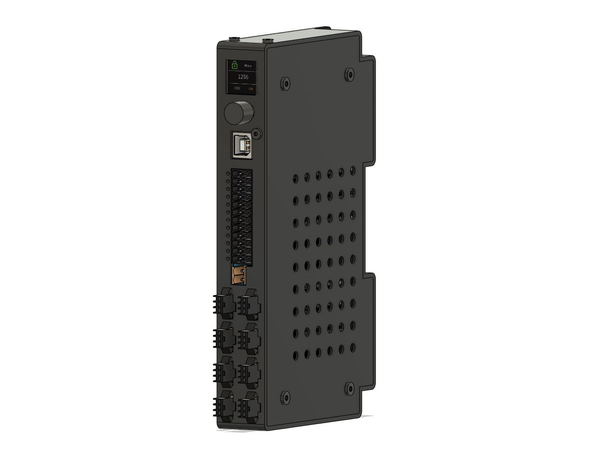

# MV-LD-8CH

该八通道光源控制器属于数字型光源控制器，支持8路3000级恒流输出，配置8路输入4路输出，可以实现128种组合光高速切换，配置彩色显示器和旋转按钮，方便用户调试，该产品适合需要驱动高速组合光，并且对速度要求高的使用场景，如高UPH的多光源检测设备、AOI设备、SPI设备等等。

## 功能特性

- 高效率四通道恒流驱动，驱动稳定性高
- 单通道最大3A电流，总输出功率最高可达384W
- 调光等级256级/3000级可切换，满足更高阶应用场景
- 高速八路输出IO，延迟小于10us

## 核心参数

- 驱动方式： 数字，恒流
- 发光方式： 常亮，频闪
- PWM频率： 48K
- 通道数： 8
- 调光方式： 手动，协议
- 调光级数： 256，3000
- 发光延迟时间： ＜10us
- 自定义组合光： 最多128种
- 通信协议： USB
- 输入电压： 24V DC
- 输入电流： 最大16A
- 输出功率： 最大384W
- 外形尺寸： 89mm*128mm*25mm
- 外壳材质： 高温尼龙+金属
- 重量： 约120g
- 安装方式： 面板、DIN35导轨

## 使用说明

本控制器采用手动设置和协议设置的方法来进行设备设置，使用中使用IO进行输入输出控制，具体的操作方式参考使用说明。

## 资料下载